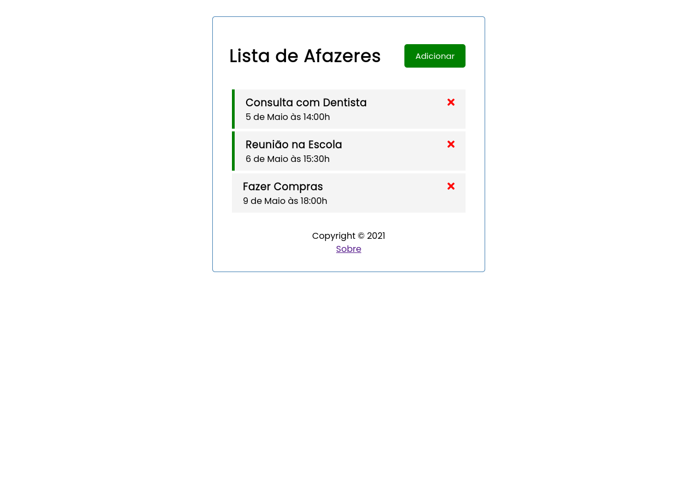
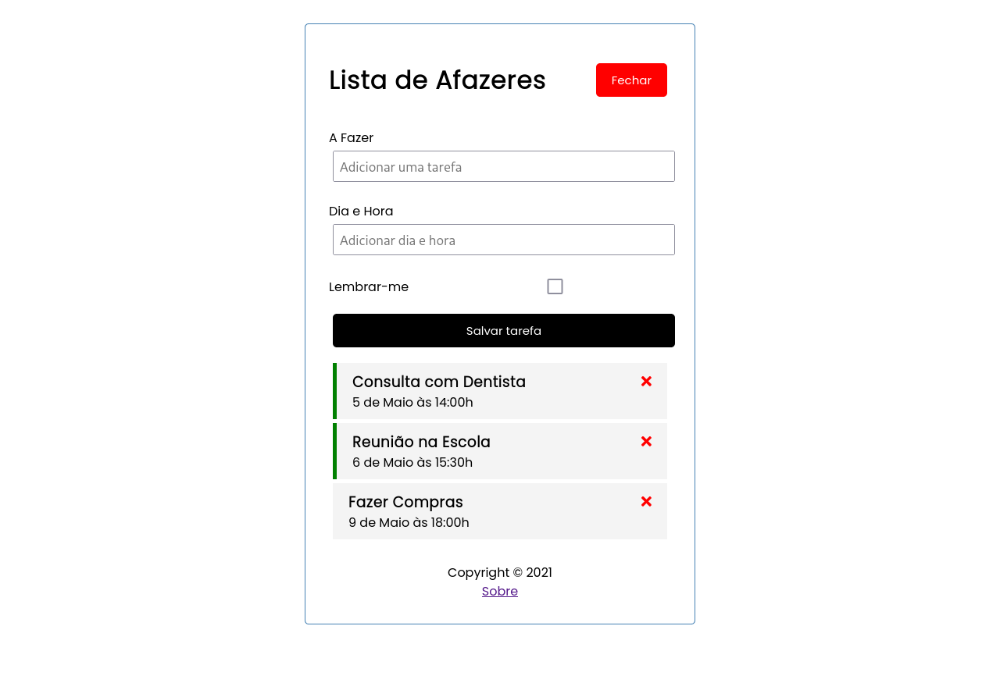

# Lista de Afazeres

Crie sua propria lista de afazeres.

## Instalação

1. Você precisa instalar as seguintes dependencias em seu sistema:

- [nodejs ^14.18.0](https://nodejs.org)
- [npm ^6.14.15](https://npmjs.com)
- [angular >= 10](https://angular.io)
- [git](https://git-scm.com/)

2. Clone o projeto:

`git clone https://github.com/richardfsilva/lista-afazeres`

3. Entre no diretório:

`cd lista-afazeres`

4. Instale as dependencias do projeto:

`npm install`

## Executando Localmente

1. Inicie o servidor angular:

`ng serve`

2. Em outro terminal, inicie o servidor do banco de dados falso:

`npm run server`

Agora, é só navegar até o endereço `http://localhost:4200/` e usar.
